# SQL基础
- [SQL基础](#sql基础)
  - [SQL执行顺序](#sql执行顺序)
  - [where与having](#where与having)
  - [表连接](#表连接)
    - [内连接 join/inner join](#内连接-joininner-join)
    - [左连接 left join](#左连接-left-join)
    - [右连接 right join](#右连接-right-join)
    - [全连接 full join](#全连接-full-join)
    - [数量分析](#数量分析)
    - [总结图](#总结图)
    - [left join的特殊情况](#left-join的特殊情况)
  - [Table和View](#table和view)
  - [功能函数](#功能函数)
    - [group by方法](#group-by方法)
      - [注意事项](#注意事项)
    - [round方法](#round方法)
    - [distinct](#distinct)
      - [注意事项](#注意事项-1)
      - [样例](#样例)
    - [条件语句](#条件语句)
      - [case-when-then](#case-when-then)
      - [if](#if)
    - [sort\_array](#sort_array)
    - [collect\_list](#collect_list)
    - [struct](#struct)
    - [DATEDIFF-TIMEDIFF](#datediff-timediff)
    - [split](#split)
    - [SPLIT\_PART](#split_part)
    - [GREATEST](#greatest)
    - [percentile](#percentile)

## SQL执行顺序
SQL各个语句的执行顺序：
1. FROM语句组装数据(包括join语句的连接)；
2. WHERE语句进行条件筛选；
3. GROUP BY进行分组；
4. avg max min等聚集函数进行计算；
5. HAVING进行筛选；
6. 计算所有的表达式；
7. SELECT字段筛选；
8. ORDER BY排序
9. LIMIT筛选

## where与having
where是一个**约束声明**，在查询结果集返回**之前约束来自数据库的数据**，且where中不能使用聚合函数。  
having是一个**过滤声明**，在查询结果集返**回后对查询结果进行过滤操作**，在having中可以使用聚合函数，且绝大多数情况用在聚合函数后对各个组的数据进行过滤。
## 表连接
不管是join、left join、right join的结果都是将**两个表的所有列都拿出来**，如果有同名的，会有a.id和b.id  
多个表的join可以是**A join B join C**，也可以是(A join B) as AB join C
### 内连接 join/inner join
inner join的操作是对两个表的交集进行连接(相同列里面的相同值) 对于A的表的每行遍历B表的每一行，对相等的进行拼接。  
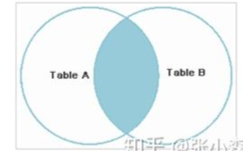
### 左连接 left join
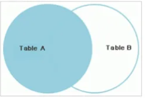  
left join 返回包括左表中所有记录和右表的连接字段相等的纪录  
left join的结果是**以左表为基础的，所有列是都有的**。但是对于A表中某个纪录，B的属性列没有对应的，会在B的属性列上显示null。**最终的结果行数和左表的行数是相同的**。  
举例：  
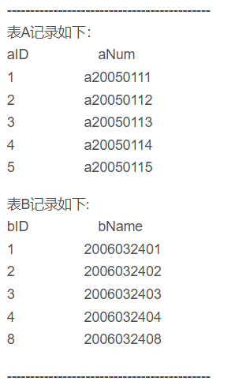  
```sql
select * from
A left join B
on A.aID=B.bID
```
结果是：  
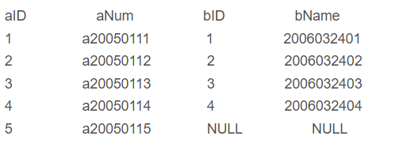  
### 右连接 right join
right join的结果是以右表为基础的，对于B中某个纪录，A没有对应的，就显示A的属性列上显示null，**最终的结果行数和右表的行数相同**。  
上述样例right join的结果：  
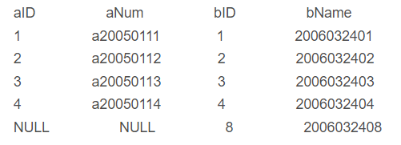  

### 全连接 full join
full join是产生两个表的并集，**即便一方在on的条件上字段不存在，也会将整行置为Null。**  
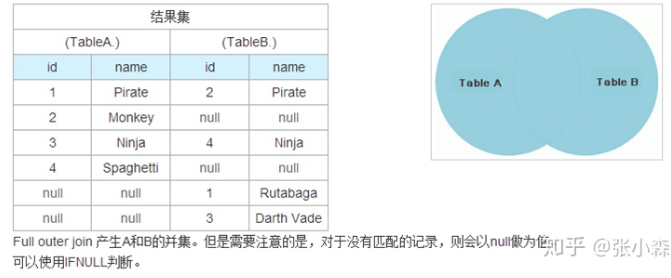  
```sql
select *
from
A full join B
on a.name=b.name
```
若要选择A和B不相交的部分，可以用full join实现
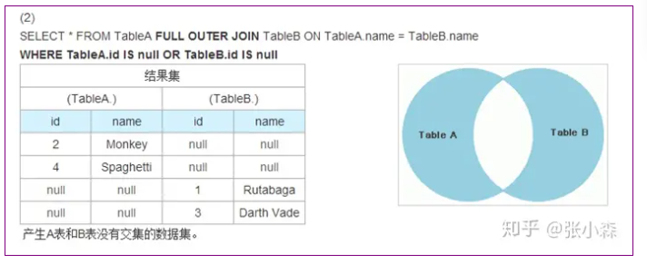  
```sql
select *
from
A full join B
on a.name=b.name
where a.id is null or b.id is null
```
### 数量分析
1. inner join(join)是A和B先做笛卡尔积，如果有on是求交集(大概率是有)  
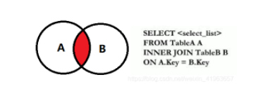

2. left join的结果和A相同  
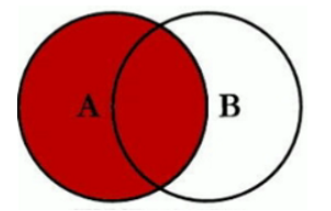

3. right join结果和B相同  
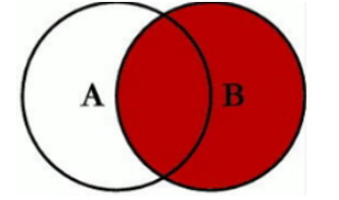

4. full join结果是A和B的并集  
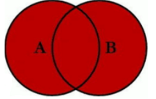

### 总结图
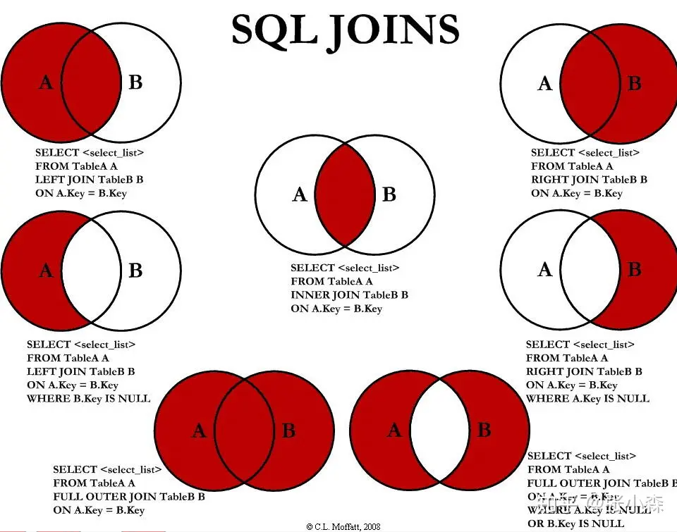
### left join的特殊情况
上面的总结可以看出left join的结果行数和左表的行数完全相同，但是实际使用中会出现很意外的情况，即left join后的结果数量远多于左表的数量。  
在A left join B时，**若用于join的key在B中有多条记录都一样时**，则会出现上述情况，Join的结果数量远多于A表。  
**解决办法是对B表join的字段先group by去重后再进行Join。**
## Table和View
Table是一种存储数据的数据库对象，它包含了多行多列的数据，其可以被创建、修改、删除、索引、分区、备份、还原等，它们是数据库中最基本的数据存储方式。Table是实际存储数据的地方，可以被直接访问、查询和修改。  
View是一种虚拟的表，它只是对一个或多个表的引用，可以当做一种虚拟的表，表的映射；它只提供了查询功能，不能被修改，可以简化复杂的查询，隐藏复杂的逻辑，提高查询效率。  
二者的区别：
1. 数据存储方式。Table中存储实际数据，View中不存储数据，只是表的引用；
2. 数据修改。Table可以直接对数据进行修改，View只能进行查询；
3. 数据结构。Table的数据结构固定，而View的数据结构动态生成；
4. 访问权限。Table和View都可以授予不同的访问权限。


## 功能函数
### group by方法
group by是sql中最常用的方法之一，功能为：**按照某一行或多行进行分组聚合，并在每个组内内使用聚合函数进行整体计算**。  
其一般的形式为：
```sql
SELECT column1, column2, ..., aggregate_function(column)
FROM table
WHERE conditions
GROUP BY column1, column2, ...
Having conditions
```
#### 注意事项
1. 在select部分出现的所有数据列，必须group by语句中的数据列，否则作为聚合函数的参数存在。
2. 在group by执行完成后，可以使用having方法进行再次过滤

### round方法
round方法用于进行四舍五入。
```sql
round(number, decimal_places)
```
1. 若第二个参数是正数，即保留n位小数。  
```sql
select round(2.345, 2)
-- 2.35 四舍五入到两位小数
```
2. 若第二个参数是负数，即-n，则四舍五入到小数点左侧n位数。  
```sql
SELECT ROUND(123456.789, -3);
-- 123000.0 四舍五入到10^3
```

### distinct
distict作用于要进行去重的时候。  
#### 注意事项
distinct必须放在开头，后续所有的字段都是联合被去重的字段。  
```sql
select distinct gender, city from patients; -- 正确
select city, distinct gender from patients; -- 错误
```
distinct必须放在开头，因为distinct之后的所有列都是一并要去重的，如果有一个放在distinct之前，就会出现异常行为。  

#### 样例
1. 作用于一列。作用于一列即仅对某一列进行去重
```sql
select distinct gender from patients;
```
2. 作用于多列。作用于多列时，针对所有的列进行联合去重，和简单的group by作用一致。
```sql
select distinct gender, city from patients; -- 对性别和城市同时去重
select gender, city from patients group by gender, city; -- 与此类group by效果完全相同
```
3. 额外功能函数。额外功能函数是指对distinct之后的结果进行额外计算。
```sql
select count(distinct gender) from patients; -- count只能统计一个字段
select count(*) from 
(select distinct gender, city from patients); -- 使用count + distinct统计有多少性别和城市组合
```

### 条件语句
#### case-when-then
case方法类似于switch-case语句，用于多种判断过程，分为数值型和表达式型。  
数值型：  
```sql
select 
    case val
        when value1 then result1
        when value2 then result2
        else result3
    end as result_type
```
数值型的在case部分为变量名，when部分判断是否相等，进入then语句。  
表达式型：  
```sql
select
    case
        when val1=value1 then result1
        when val2 like '%_xxx' then result2
        else result3
    end as result_type
```
表达式型在case部分无内容，在when部分为表达式的方式。  
case-when-then表达式可以当做一个整体，可以对其进行distinct或count等方法。  
```sql
select
    count(distinct
            case
                when val1=value1 then result1
                when val2 like '%_xxx' then result2
                else result3
            end) as result_count
```
#### if
if方法相当于if-else语句，语法为if(expr1, value1, value2)，其中expr1为判断语句，当为true时结果为value1，否则为value2。  
```sql
select
    if(table1.status_id='yes', '状态1', '状态2') as status_id
from table1
```
### sort_array
sort_array是用于SQL中进行排序数组的功能，**其通常只在Hive表形式的数据库中存在，而非所有表均有**。  
```sql
sort_array(array_expression, ASC/DESC)
-- 第二个参数表示升序或者降序
```
### collect_list
collect_list是用于将多行数据的值合并到一个数组中的SQL聚合函数，**其通常只在Hive表形式的数据库中存在，而非所有表均有**。  
```sql
collect_list(expr)
```
其往往用在group by之后，在每个分组内的多个行将数值集合到一个list中。  
```sql
SELECT order_id, COLLECT_LIST(product_name) AS products_ordered
FROM orders
GROUP BY order_id;
-- 在订单id相同的所有产品名称product_name合并到一个list中
```
### struct
struct是用来创建结构体的方法，**其通常只在Hive表形式的数据库中存在，而非所有表均有**。  
```sql
struct(expr1, expr2 ...)
```
用于将多个列或者表达式构建为一个结构体，用一列存储这个结构。
```sql
SELECT name, STRUCT(age, address) AS personal_info
FROM employees;
```
上述将两个列合并为一个info结构体。  
```sql
SELECT name, personal_info.age, personal_info.address
FROM employees;
```
sql中访问具体数值的时候可以使用'.'操作。
### DATEDIFF-TIMEDIFF
DATEDIFF函数用于计算两个日期之间的天数差，TIMEDIFF用于计算两个日期之间的如小时、分钟等时间差。
```sql
DATEDIFF(date1, date2)
TIMEDIFF(time1, time2)
```
### split
split方法用于将一个字符串按照指定的分隔符进行分割成多个子字符串的方法，广泛存在于各种数据库中。
```sql
split(string, delimiter)
```
只需要指定处理的字符串和分隔符即可。
```sql
SELECT order_id, SPLIT(product_names, ',') AS products_ordered
FROM orders;
```
split的结果是一个子字符串数组。  
当需要选择某位置的结果时，按照对字符串数组的处理方式即可。(?没实践过)
### SPLIT_PART
SPLIT_PART方法与上述split方法类似，但是其需要但是其仅在部分数据库中存在。
```sql
SPLIT_PART(string, delimiter, position)
```
基本模式是对string按照delimiter进行分割，返回指定位置position的值（**注意从1开始数而非从0开始**）  
```sql
SELECT SPLIT_PART('John,Doe,35', ',', 2) as last_name
from table1
-- 结果是Doe 第二个位置的值
```
### GREATEST
GREATEST方法用于比较多个表达式，并获得其中最大值的方法。  
```sql
GREATEST(expr1, expr2, ... exprn)
```
**GREATEST中的expr可以列、常量、函数等，但是不能用于比较多个列，多个行等。**  
### percentile
percentile方法用于计算数据的分位数。  
```sql
percentile(column, 分位数值)
```
